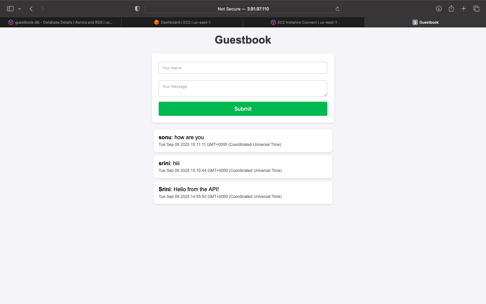
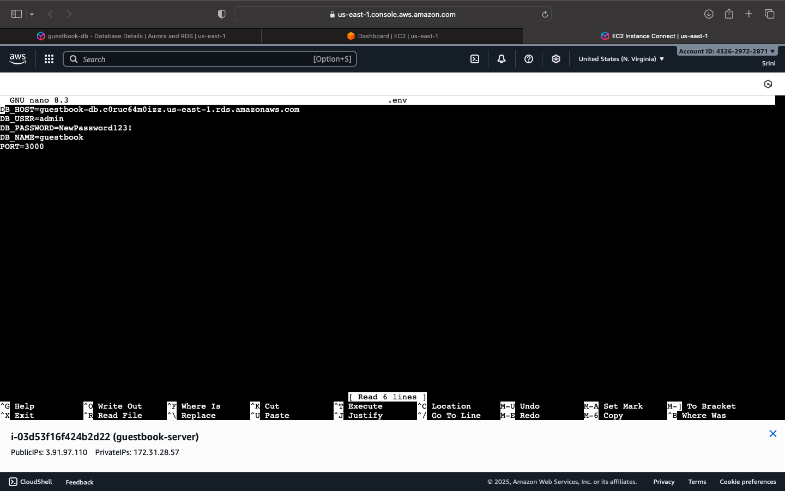
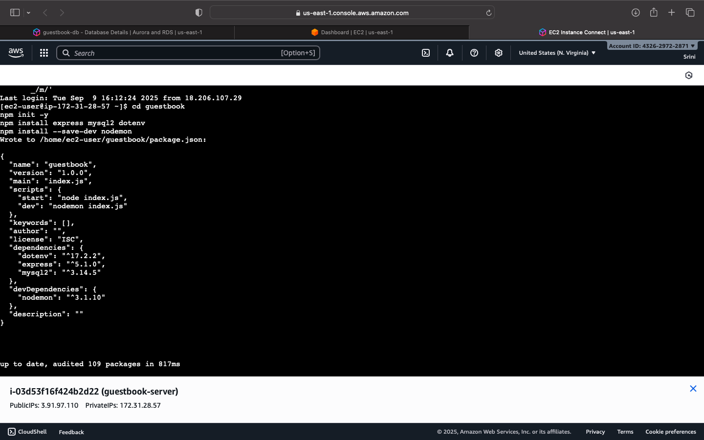

# AWS Dynamic Website (Guestbook)

## 📌 Project Overview  
This project demonstrates how to deploy a **dynamic guestbook website** on **AWS EC2** with a **MySQL RDS database**.  
Users can submit their name and message, which are stored in the database and displayed on the website.  

---

## 🔧 Tools & Services  
- **Amazon EC2** (for hosting the Node.js application)  
- **Amazon RDS (MySQL)** (for database management)  
- **Node.js & Express.js** (for backend server)  
- **MySQL2 & Dotenv** (for database connectivity & configuration)  

---

## 🚀 Implementation Steps  
1. Launched an **EC2 instance** and installed Node.js & MySQL client  
2. Set up an **RDS MySQL instance** and created the database schema  
3. Configured `.env` file for database connection  
4. Built a **Node.js Express application** with REST API routes  
5. Connected EC2 application to RDS and tested database operations  
6. Kept the app running continuously using **PM2**  
7. Verified application via browser using **EC2 Public IP**  

---

## 📸 Project Output  

### 1. Guestbook Page  
  

### 2. Environment Configuration  
  

### 3. Package Setup  
  

---

## 🌟 Outcome  
A fully functional **dynamic guestbook website** hosted on **AWS EC2**, with persistent storage in **AWS RDS MySQL**.  

---

## 🙌 Acknowledgement  
This project was completed as part of my **internship with Pinnacle Labs**.  
